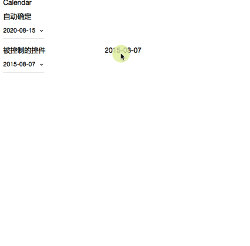

# melon-calendar

[](https://coveralls.io/github/react-melon/melon-calendar?branch=master)
[](https://www.npmjs.com/package/melon-calendar)
[](https://travis-ci.org/react-melon/melon-calendar)

DatePicker Components in [React Melon Family](http://react-melon.github.io/melon/)

### members

* **Calendar** - pick a date
* **RangeCalendar** - Select a date interval by day
* **UnitCalendar** - Select a date interval by week, month or year

## Screenshots

* Calendar



* RangeCalendar & UnitCalendar


## Install

### npm

[](https://npmjs.org/package/melon-calendar)

### bower

```
bower install melon-calendar
```

## Usage

```js
import React from 'react';
import ReactDOM from 'react-dom';

import Calendar from 'melon-calendar';
import RangeCalendar from 'melon-calendar/lib/RangeCalendar';
import UnitCalendar from 'melon-calendar/lib/UnitCalendar';

ReactDOM.render(<Calendar />, container);
```

## Examples

[demo](http://react-melon.github.io/melon/#/components?name=Calendar)

## Test Case

```
npm test
```
